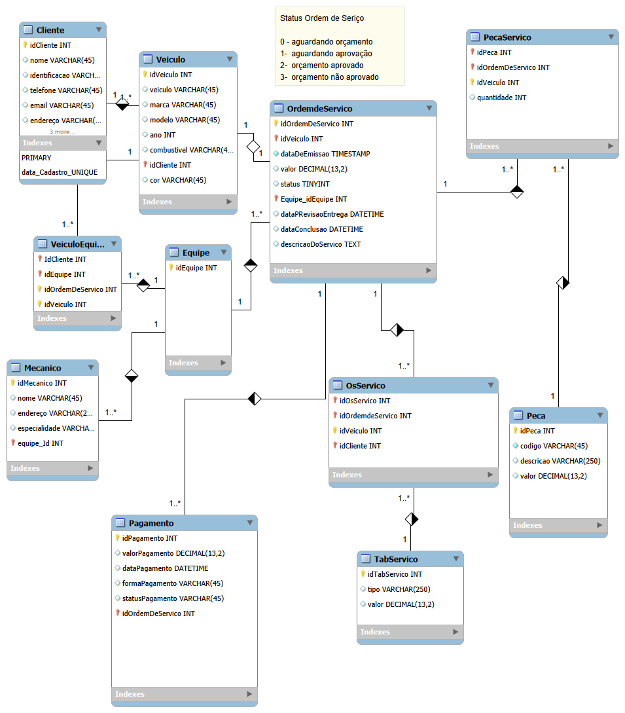
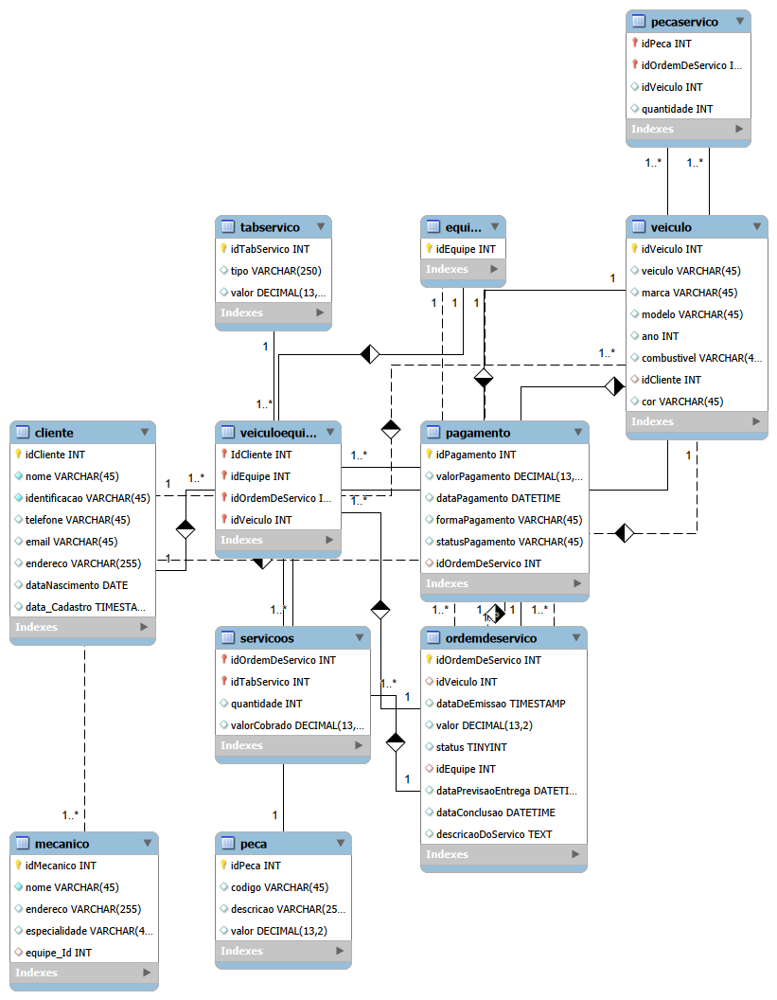

# Sistema de Gerenciamento de Oficina Mecânica 

Este projeto consiste na modelagem e implementação de um banco de dados relacional para o controle operacional de uma oficina mecânica. O sistema gerencia desde o cadastro de clientes e veículos até a execução de serviços por equipes especializadas e o processamento de pagamentos.

##  Modelagem do Sistema

A estrutura foi pensada para garantir a integridade dos dados e a rastreabilidade financeira. O processo de design está documentado nos diagramas abaixo:

### 1. Projeto Lógico Original
Esquema conceitual inicial que serviu de base para o desenvolvimento:

### 2. Projeto Lógico Final (Refinado)
Modelo final com a implementação da tabela associativa `ServicoOS` e normalização das entidades:

##  Destaques Técnicos

- **Tabela `ServicoOS`**: Implementação crucial para gerenciar o relacionamento N:M entre Ordens de Serviço e o catálogo de serviços (`TabServico`). Ela permite que uma OS tenha múltiplos serviços e preserve o valor cobrado historicamente.
- **Gestão de Equipes**: Uso da tabela `Equipe` para permitir que múltiplos mecânicos colaborem em uma única Ordem de Serviço de forma organizada.
- **Rastreabilidade**: Separação clara entre peças (`PecaServico`) e serviços (`ServicoOS`) para detalhamento preciso da fatura do cliente.

##  Estrutura de Scripts SQL

Para facilitar a avaliação e execução, o projeto está dividido em:

1.  **`cria_tabelas_ddl.sql`**: Script de criação de todas as tabelas e definição de constraints.
2.  **`insercao_de_dados_dml.sql`** inserção de dados fictcios no banco de dados oficina_externa, qualquer semelhança com dados pessoais da vida real é mera coincidencia.
3.  **`consulta_dql.sql`**: Conjunto de queries para análise de dados, incluindo filtros com `LIKE`, ordenações complexas e uso de subqueries.

##  Como Executar
1. Execute o script **DDL** para criar o schema.
2. Popule o banco com o script **DML**.
3. Utilize o script **DQL** para validar os relatórios e a lógica do banco.

---
*Projeto desenvolvido para o desafio de projeto da formação de Banco de Dados da DIO.*
